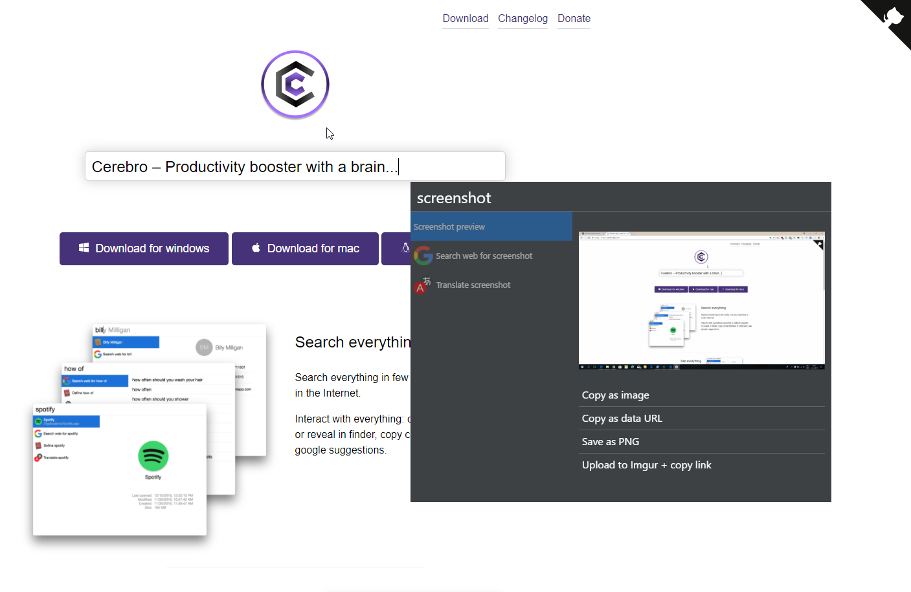

# сerebro-screenshot

> Take full-screen screenshots from within cerebro

>_(Screenshot ironically not made with this plugin, though this would have been a nice opportunity to see the [Droste effect](https://en.wikipedia.org/wiki/Droste_effect) in action)_

## Usage
Type screenshot and then select a way of copying/saving.

## Features

* Copy screenshot as image (paste in apps/programs that support image pastes such as paint, e-mail or gitter)
* Copy as data URL, for pasting the raw URL into the browser or somewhere else that supports URLs
* Save as PNG
* Upload (anonymously) to Imgur & copy resulting link to clipboard
* Option to disable/silence notifications

## Related

* [Cerebro](http://github.com/KELiON/cerebro)
* [cerebro-plugin](http://github.com/KELiON/cerebro-plugin) – boilerplate to create Cerebro plugins

## License

MIT © lawgsy
